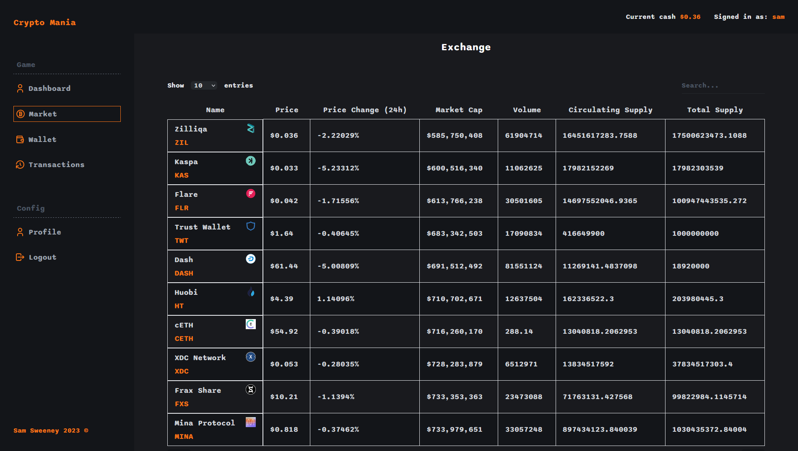

# Crypto Mania

## Description
This is a react app for buying and selling crypto currency using fake currency (AUD). The app uses the [CoinGecko API](https://www.coingecko.com/en/api) to get the latest crypto currency prices. The app is deployed on Heroku and can be accessed [here](https://crypto-mania.herokuapp.com/). The app uses the following technologies:
- React
- React Router
- MongoDB
- Express
- Node.js

## Installation
To install the app, clone the repository and run `npm install` in the root directory. Then run `npm run dev` to start the app.

## Usage
The app is deployed on Heroku and can be accessed [here](https://crypto-mania.herokuapp.com/). The app can also be run locally by cloning the repository and running `npm run dev` in the root directory.

## License
MIT License

## Application Screenshot

